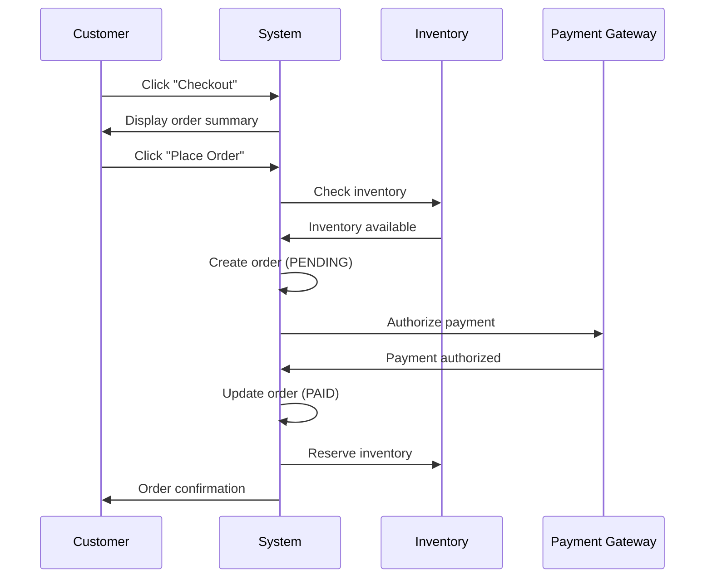

# Functional Specification Document (FSD)

## [Feature/Module Name]

**Version:** 1.0.0  
**Date:** YYYY-MM-DD  
**Status:** Draft | In Review | Approved

**Author:** [Developer/Analyst Name]  
**Reviewers:** [Names]  
**Related Documents:** [SRD-XXX, SAD-XXX]

---

## Document Control

| Version | Date | Author | Changes |
|---------|------|--------|---------|
| 1.0.0 | YYYY-MM-DD | [Author] | Initial specification |

---

## Table of Contents

1. [Overview](#overview)
2. [Functional Requirements Summary](#functional-requirements-summary)
3. [User Interface Specifications](#user-interface-specifications)
4. [Detailed Workflows](#detailed-workflows)
5. [Business Rules & Logic](#business-rules--logic)
6. [Data Model](#data-model)
7. [API Specifications](#api-specifications)
8. [Integration Points](#integration-points)
9. [Error Handling](#error-handling)
10. [Edge Cases & Validations](#edge-cases--validations)
11. [Performance Requirements](#performance-requirements)
12. [Security Considerations](#security-considerations)
13. [Testing Scenarios](#testing-scenarios)

---

## 1. Overview

### 1.1 Purpose

[Brief description of what this feature/module does and why it's needed]

**Example:**
This document specifies the Order Processing System, which handles the complete lifecycle of customer orders from placement through fulfillment. The system ensures accurate order tracking, inventory management, and payment processing.

### 1.2 Scope

**In Scope:**
- [Feature 1]
- [Feature 2]
- [Feature 3]

**Out of Scope:**
- [Excluded feature 1]
- [Excluded feature 2]

### 1.3 Definitions & Acronyms

| Term | Definition |
|------|------------|
| SKU | Stock Keeping Unit - Unique product identifier |
| OMS | Order Management System |
| [Term] | [Definition] |

---

## 2. Functional Requirements Summary

Link to source requirements from SRD:

| Requirement ID | Description | Priority | Status |
|----------------|-------------|----------|--------|
| FR-001 | User can create order | Critical | In Progress |
| FR-002 | System validates inventory | Critical | Not Started |
| FR-003 | Payment processing | Critical | In Progress |

---

## 3. User Interface Specifications

### 3.1 Screen/Page: [Screen Name]

**Purpose:** [What this screen accomplishes]

**Wireframe/Mockup:**
[Embed or link to Figma/design files]

**Elements:**

| Element | Type | Properties | Validation |
|---------|------|------------|------------|
| Product Name | Text Input | Max 100 chars, required | Non-empty, alphanumeric |
| Quantity | Number Input | Min 1, Max 999 | Integer, positive |
| Add to Cart | Button | Primary action | Enabled if form valid |

**User Actions:**

1. **Action:** User enters product details
   - **System Response:** Validates input in real-time
   - **Validation:** Shows error messages inline

2. **Action:** User clicks "Add to Cart"
   - **System Response:** Adds item to cart, updates cart count
   - **Success Message:** "Product added to cart"

### 3.2 Screen/Page: [Next Screen]

[Repeat structure for each screen]

---

## 4. Detailed Workflows

### 4.1 Workflow: Order Placement

**Actors:** Customer, System, Payment Gateway, Inventory Service

**Trigger:** Customer clicks "Checkout" button

**Preconditions:**
- User is authenticated
- Cart contains at least one item
- All items in stock

**Main Flow:**

```
1. Customer clicks "Checkout"
2. System displays order summary page
   - Cart items with prices
   - Shipping address (from profile or allow edit)
   - Payment method selection
3. Customer reviews order
4. Customer clicks "Place Order"
5. System validates order:
   a. Check inventory availability for all items
   b. Calculate total amount (items + shipping + tax)
   c. Validate payment method
6. System creates order record (status: PENDING)
7. System calls Payment Gateway API
   - Request payment authorization
   - Timeout: 10 seconds
8. Payment Gateway returns authorization
9. System updates order status: PAID
10. System reserves inventory (locks SKUs)
11. System sends order confirmation email
12. System displays order confirmation page
```

**Sequence Diagram:**



**Alternative Flows:**

**5a. Insufficient Inventory:**
```
5a.1. System detects item out of stock
5a.2. System displays error: "Product [X] is out of stock"
5a.3. System offers to remove item or save for later
5a.4. Return to cart page
```

**8a. Payment Failed:**
```
8a.1. Payment Gateway returns failure (declined card)
8a.2. System updates order status: PAYMENT_FAILED
8a.3. System displays error message with retry option
8a.4. User can:
      - Try different payment method
      - Cancel order
```

**Exception Flows:**

**E1. Payment Gateway Timeout:**
```
E1.1. Payment API does not respond within 10 seconds
E1.2. System logs timeout error
E1.3. System updates order status: PAYMENT_PENDING
E1.4. System displays: "Payment processing. You'll receive confirmation via email"
E1.5. Background job polls payment status every 30 seconds (max 10 attempts)
```

**Postconditions:**
- Order record created in database
- Inventory reserved
- Payment processed
- Confirmation email sent

---

### 4.2 Workflow: [Another Workflow]

[Repeat structure for each workflow]

---

## 5. Business Rules & Logic

### 5.1 Pricing Calculation

**Rule:** Total Order Amount = Subtotal + Shipping + Tax - Discounts

**Detailed Logic:**

```python
def calculate_order_total(cart_items, shipping_address, promo_code=None):
    """
    Calculate order total with all fees and discounts.
    
    Args:
        cart_items: List of {product_id, quantity, unit_price}
        shipping_address: {country, state, zip}
        promo_code: Optional discount code
    
    Returns:
        {subtotal, shipping, tax, discount, total}
    """
    
    # 1. Calculate subtotal
    subtotal = sum(item.quantity * item.unit_price for item in cart_items)
    
    # 2. Calculate shipping
    if subtotal >= 50:
        shipping = 0  # Free shipping over $50
    elif shipping_address.country == 'US':
        shipping = 5.99
    else:
        shipping = 12.99
    
    # 3. Calculate tax (US only)
    tax = 0
    if shipping_address.country == 'US':
        state_tax_rates = {
            'CA': 0.0725,
            'NY': 0.08875,
            'TX': 0.0625,
            # ... other states
        }
        tax_rate = state_tax_rates.get(shipping_address.state, 0)
        tax = (subtotal + shipping) * tax_rate
    
    # 4. Apply discount
    discount = 0
    if promo_code:
        discount_rule = get_discount_rule(promo_code)
        if discount_rule.type == 'PERCENTAGE':
            discount = subtotal * discount_rule.value
        elif discount_rule.type == 'FIXED':
            discount = min(discount_rule.value, subtotal)  # Can't exceed subtotal
    
    # 5. Calculate total
    total = subtotal + shipping + tax - discount
    
    return {
        'subtotal': round(subtotal, 2),
        'shipping': round(shipping, 2),
        'tax': round(tax, 2),
        'discount': round(discount, 2),
        'total': round(total, 2)
    }
```

**Edge Cases:**
- If discount > subtotal, cap discount at subtotal
- If total < $0 (shouldn't happen), raise error
- Round all amounts to 2 decimal places

### 5.2 Inventory Reservation

**Rule:** Inventory is reserved when payment authorized, released after 15 minutes if order not fulfilled

**Logic:**

```sql
-- Reserve inventory
BEGIN TRANSACTION;

UPDATE products
SET reserved_quantity = reserved_quantity + :quantity,
    available_quantity = available_quantity - :quantity
WHERE product_id = :product_id
  AND available_quantity >= :quantity;

-- Check if update succeeded
IF (ROW_COUNT = 0) THEN
    ROLLBACK;
    RAISE ERROR 'Insufficient inventory';
END IF;

INSERT INTO inventory_reservations (
    order_id,
    product_id,
    quantity,
    reserved_at,
    expires_at
) VALUES (
    :order_id,
    :product_id,
    :quantity,
    NOW(),
    NOW() + INTERVAL '15 minutes'
);

COMMIT;
```

**Cleanup Job (Background):**
```python
# Run every 5 minutes
def release_expired_reservations():
    expired = db.query("""
        SELECT * FROM inventory_reservations
        WHERE expires_at < NOW()
          AND status = 'ACTIVE'
    """)
    
    for reservation in expired:
        db.execute("""
            UPDATE products
            SET reserved_quantity = reserved_quantity - :quantity,
                available_quantity = available_quantity + :quantity
            WHERE product_id = :product_id
        """, reservation)
        
        db.execute("""
            UPDATE inventory_reservations
            SET status = 'EXPIRED'
            WHERE id = :reservation_id
        """, reservation)
```

---

## 6. Data Model

### 6.1 Entity: Order

**Table:** `orders`

| Column | Type | Constraints | Description |
|--------|------|-------------|-------------|
| order_id | UUID | PRIMARY KEY | Unique order identifier |
| user_id | UUID | FOREIGN KEY → users(id), NOT NULL | Customer who placed order |
| status | VARCHAR(20) | NOT NULL, CHECK IN (...) | Order status (see enum) |
| subtotal | DECIMAL(10,2) | NOT NULL, >= 0 | Items total before fees |
| shipping | DECIMAL(10,2) | NOT NULL, >= 0 | Shipping cost |
| tax | DECIMAL(10,2) | NOT NULL, >= 0 | Tax amount |
| discount | DECIMAL(10,2) | NOT NULL, >= 0 | Discount applied |
| total | DECIMAL(10,2) | NOT NULL, > 0 | Final order total |
| created_at | TIMESTAMP | NOT NULL, DEFAULT NOW() | Order creation time |
| updated_at | TIMESTAMP | NOT NULL, DEFAULT NOW() | Last update time |

**Status Enum:**
```sql
CREATE TYPE order_status AS ENUM (
    'PENDING',           -- Order created, awaiting payment
    'PAYMENT_FAILED',    -- Payment declined
    'PAYMENT_PENDING',   -- Payment processing
    'PAID',              -- Payment successful
    'PROCESSING',        -- Order being prepared
    'SHIPPED',           -- Order dispatched
    'DELIVERED',         -- Order received by customer
    'CANCELLED',         -- Order cancelled
    'REFUNDED'           -- Payment refunded
);
```

**Indexes:**
```sql
CREATE INDEX idx_orders_user_created ON orders(user_id, created_at DESC);
CREATE INDEX idx_orders_status ON orders(status);
```

### 6.2 Entity: Order Items

**Table:** `order_items`

| Column | Type | Constraints | Description |
|--------|------|-------------|-------------|
| item_id | UUID | PRIMARY KEY | Unique item identifier |
| order_id | UUID | FOREIGN KEY → orders(order_id), NOT NULL | Parent order |
| product_id | UUID | FOREIGN KEY → products(id), NOT NULL | Product purchased |
| quantity | INT | NOT NULL, > 0 | Quantity ordered |
| unit_price | DECIMAL(10,2) | NOT NULL, > 0 | Price per unit at time of order |
| subtotal | DECIMAL(10,2) | NOT NULL, > 0 | quantity × unit_price |

**Constraints:**
```sql
ALTER TABLE order_items
ADD CONSTRAINT chk_subtotal
CHECK (subtotal = quantity * unit_price);
```

---

## 7. API Specifications

### 7.1 Create Order

**Endpoint:** `POST /api/v1/orders`

**Authentication:** Required (Bearer token)

**Request:**
```json
{
  "cart_items": [
    {
      "product_id": "uuid",
      "quantity": 2
    }
  ],
  "shipping_address": {
    "line1": "123 Main St",
    "city": "San Francisco",
    "state": "CA",
    "zip": "94105",
    "country": "US"
  },
  "payment_method_id": "pm_xyz123",
  "promo_code": "SAVE10"
}
```

**Response (Success - 201 Created):**
```json
{
  "order_id": "uuid",
  "status": "PAID",
  "items": [
    {
      "product_id": "uuid",
      "name": "Wireless Mouse",
      "quantity": 2,
      "unit_price": 29.99,
      "subtotal": 59.98
    }
  ],
  "pricing": {
    "subtotal": 59.98,
    "shipping": 0.00,
    "tax": 5.25,
    "discount": 5.99,
    "total": 59.24
  },
  "created_at": "2024-01-15T10:30:00Z"
}
```

**Response (Error - 400 Bad Request):**
```json
{
  "error": {
    "code": "insufficient_inventory",
    "message": "Product 'Wireless Mouse' is out of stock",
    "details": {
      "product_id": "uuid",
      "requested": 2,
      "available": 0
    }
  }
}
```

**Response (Error - 402 Payment Required):**
```json
{
  "error": {
    "code": "payment_failed",
    "message": "Your card was declined",
    "details": {
      "reason": "insufficient_funds"
    }
  }
}
```

**Validation Rules:**
- `cart_items`: Must have at least 1 item, max 50 items
- `quantity`: Min 1, max 999 per item
- `shipping_address`: All fields required, validate zip/postal code format
- `payment_method_id`: Must be valid and belong to authenticated user
- `promo_code`: Optional, validate if provided

**Rate Limit:** 10 requests per minute per user

---

## 8. Integration Points

### 8.1 Payment Gateway (Stripe)

**Purpose:** Process credit card payments

**Integration Type:** REST API

**Endpoint:** `https://api.stripe.com/v1/payment_intents`

**Authentication:** API Key (Secret key)

**Request Flow:**
```javascript
// 1. Create payment intent
const paymentIntent = await stripe.paymentIntents.create({
  amount: 5924,  // In cents
  currency: 'usd',
  payment_method: 'pm_xyz123',
  confirm: true,
  metadata: {
    order_id: 'uuid'
  }
});

// 2. Check status
if (paymentIntent.status === 'succeeded') {
  // Payment successful, update order
  updateOrderStatus(order_id, 'PAID');
} else if (paymentIntent.status === 'requires_action') {
  // 3D Secure authentication needed
  return { client_secret: paymentIntent.client_secret };
}
```

**Error Handling:**
- Timeout: 10 seconds
- Retry: 3 attempts with exponential backoff (1s, 2s, 4s)
- Fallback: Mark order as PAYMENT_PENDING, background job retries

**Webhook (Payment Confirmation):**
```
POST /webhooks/stripe

Payload:
{
  "type": "payment_intent.succeeded",
  "data": {
    "object": {
      "id": "pi_xyz",
      "metadata": {
        "order_id": "uuid"
      }
    }
  }
}
```

### 8.2 Email Service (SendGrid)

**Purpose:** Send order confirmation emails

**Integration Type:** REST API

**Request:**
```javascript
await sendgrid.send({
  to: user.email,
  from: 'orders@example.com',
  templateId: 'd-order-confirmation',
  dynamicTemplateData: {
    order_id: order.id,
    customer_name: user.name,
    items: order.items,
    total: order.total
  }
});
```

**Retry Logic:** 3 attempts, then log failure (email non-critical)

---

## 9. Error Handling

### 9.1 Error Codes & Messages

| Error Code | HTTP Status | Message | User Action |
|------------|-------------|---------|-------------|
| `insufficient_inventory` | 400 | Product '[name]' is out of stock | Remove item or wait |
| `invalid_promo_code` | 400 | Promo code '[code]' is invalid or expired | Try different code |
| `payment_failed` | 402 | Your card was declined | Use different card |
| `payment_timeout` | 504 | Payment processing. Check email for confirmation | Wait for email |
| `inventory_reservation_failed` | 409 | Unable to reserve inventory | Retry order |

### 9.2 Error Response Format

```json
{
  "error": {
    "code": "error_code",
    "message": "Human-readable message",
    "details": {
      "field": "additional context"
    },
    "request_id": "uuid"  // For support tracking
  }
}
```

### 9.3 Logging

**Log Levels:**
- **ERROR:** Payment failures, inventory reservation failures, API timeouts
- **WARN:** Promo code invalid, item out of stock
- **INFO:** Order created, order status updates
- **DEBUG:** API request/response payloads (sanitize sensitive data)

**Example Log:**
```json
{
  "timestamp": "2024-01-15T10:30:00Z",
  "level": "ERROR",
  "message": "Payment gateway timeout",
  "context": {
    "order_id": "uuid",
    "user_id": "uuid",
    "payment_method": "pm_xyz123",
    "amount": 59.24,
    "error": "Connection timeout after 10s"
  }
}
```

---

## 10. Edge Cases & Validations

### 10.1 Concurrency Scenarios

**Scenario:** Two users try to buy last item simultaneously

**Solution:** Database-level locking
```sql
SELECT * FROM products
WHERE product_id = :id
FOR UPDATE;  -- Row-level lock

-- Check inventory
IF available_quantity >= :requested THEN
    UPDATE products SET available_quantity = available_quantity - :requested;
    COMMIT;
ELSE
    ROLLBACK;
END IF;
```

### 10.2 Decimal Precision

**Problem:** Floating point arithmetic errors (e.g., 0.1 + 0.2 = 0.30000000000000004)

**Solution:** Use DECIMAL type, always round to 2 places
```python
from decimal import Decimal, ROUND_HALF_UP

def round_money(amount):
    return Decimal(amount).quantize(Decimal('0.01'), rounding=ROUND_HALF_UP)
```

### 10.3 Time Zone Handling

**Rule:** Store all timestamps in UTC, convert to user timezone for display

```python
from datetime import datetime
import pytz

# Store in DB
created_at = datetime.utcnow()  # 2024-01-15 10:30:00 UTC

# Display to user (PST)
user_tz = pytz.timezone('America/Los_Angeles')
display_time = created_at.replace(tzinfo=pytz.utc).astimezone(user_tz)
# 2024-01-15 02:30:00 PST
```

---

## 11. Performance Requirements

| Metric | Requirement | Measurement |
|--------|-------------|-------------|
| Order creation latency | P95 < 2 seconds | API response time |
| Database query time | P99 < 100ms | Query execution time |
| Payment API timeout | 10 seconds | HTTP request timeout |
| Email delivery | < 1 minute | SendGrid webhook |
| Throughput | 1000 orders/hour | Load testing |

---

## 12. Security Considerations

**Authentication:**
- All endpoints require valid JWT token
- Token expiration: 1 hour

**Authorization:**
- Users can only access their own orders
- Admins can access all orders

**Data Protection:**
- Payment card data never stored (use tokens)
- Sensitive fields logged as [REDACTED]
- HTTPS required for all API calls

**Rate Limiting:**
- 10 order creations per minute per user
- 100 order queries per minute per user

---

## 13. Testing Scenarios

### 13.1 Happy Path

```gherkin
Given a logged-in user with 2 items in cart
And both items are in stock
And user has valid payment method
When user completes checkout
Then order is created with status PAID
And inventory is reserved
And user receives confirmation email
```

### 13.2 Out of Stock

```gherkin
Given a logged-in user with item in cart
And item has 0 available quantity
When user attempts checkout
Then user sees "Product is out of stock" error
And no order is created
And no payment is charged
```

### 13.3 Payment Failure

```gherkin
Given a logged-in user ready to checkout
And payment method will be declined
When user submits order
Then order is created with status PAYMENT_FAILED
And user sees payment error message
And inventory is NOT reserved
```

---

## Appendix

### A. Sample Data

**Sample Order:**
```json
{
  "order_id": "550e8400-e29b-41d4-a716-446655440000",
  "user_id": "123e4567-e89b-12d3-a456-426614174000",
  "status": "PAID",
  "items": [
    {
      "product_id": "prod_001",
      "name": "Wireless Mouse",
      "quantity": 2,
      "unit_price": 29.99,
      "subtotal": 59.98
    }
  ],
  "pricing": {
    "subtotal": 59.98,
    "shipping": 0.00,
    "tax": 5.25,
    "discount": 5.99,
    "total": 59.24
  }
}
```

### B. Database Migrations

**Migration:** `001_create_orders_table.sql`
```sql
CREATE TABLE orders (
    order_id UUID PRIMARY KEY DEFAULT gen_random_uuid(),
    user_id UUID NOT NULL REFERENCES users(id),
    status order_status NOT NULL,
    subtotal DECIMAL(10,2) NOT NULL CHECK (subtotal >= 0),
    shipping DECIMAL(10,2) NOT NULL CHECK (shipping >= 0),
    tax DECIMAL(10,2) NOT NULL CHECK (tax >= 0),
    discount DECIMAL(10,2) NOT NULL CHECK (discount >= 0),
    total DECIMAL(10,2) NOT NULL CHECK (total > 0),
    created_at TIMESTAMP NOT NULL DEFAULT NOW(),
    updated_at TIMESTAMP NOT NULL DEFAULT NOW()
);

CREATE INDEX idx_orders_user_created ON orders(user_id, created_at DESC);
CREATE INDEX idx_orders_status ON orders(status);
```

---

**End of Document**
