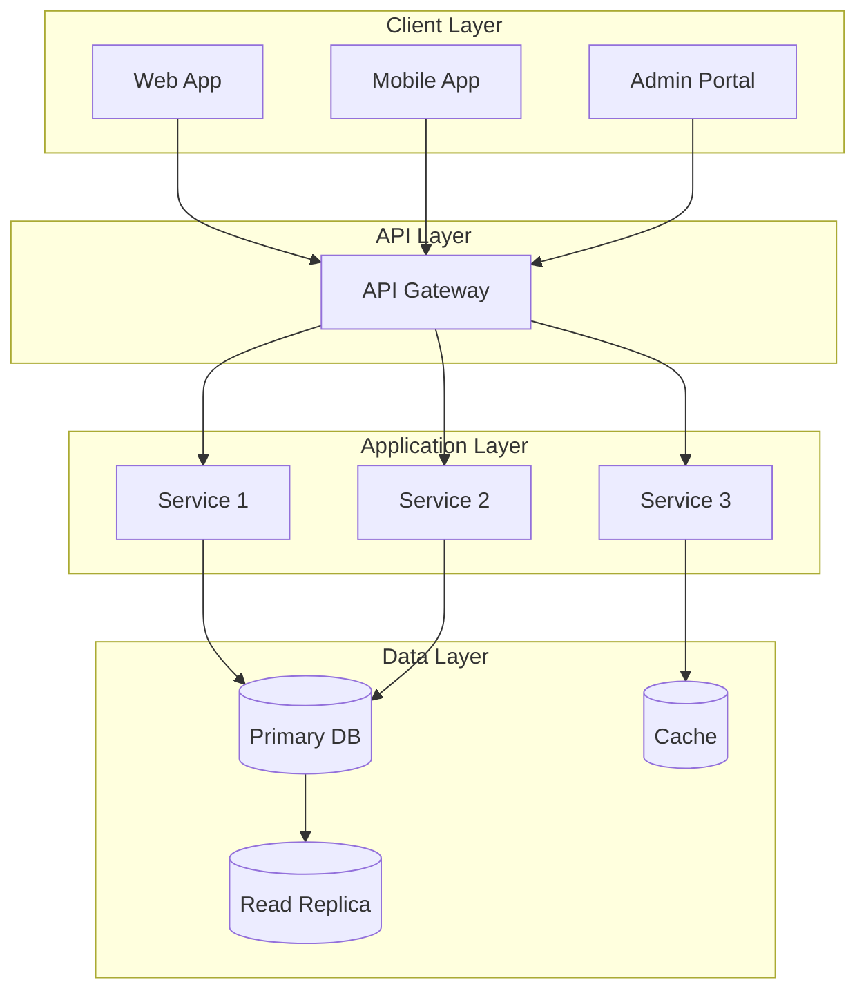
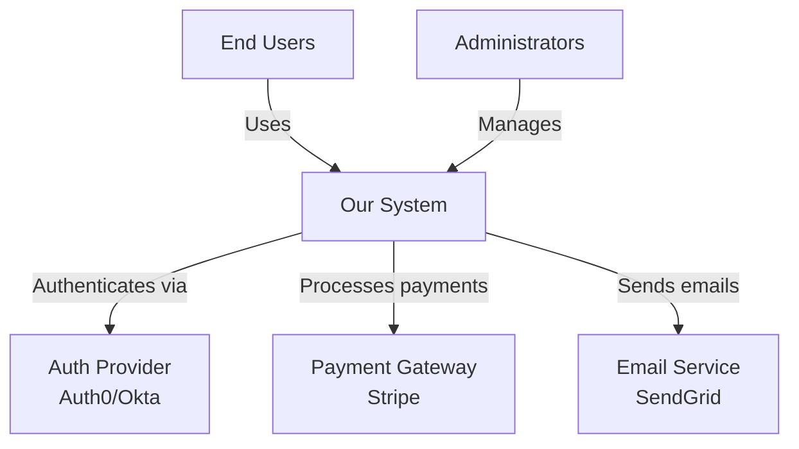
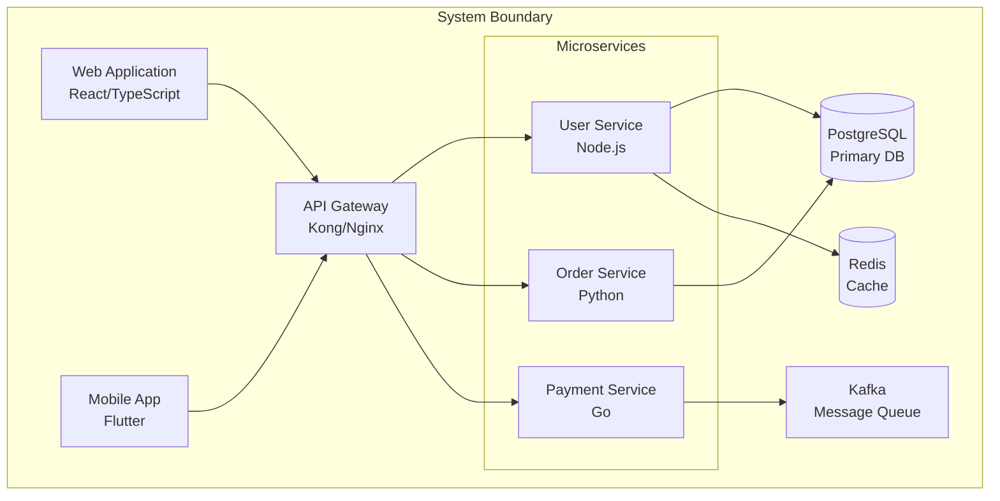
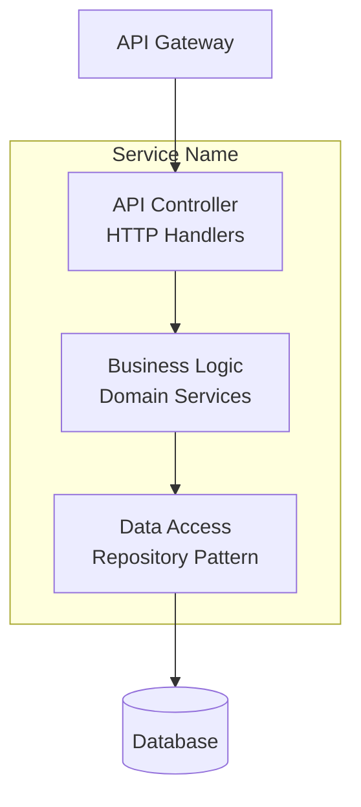
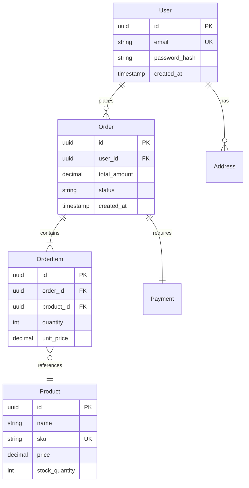
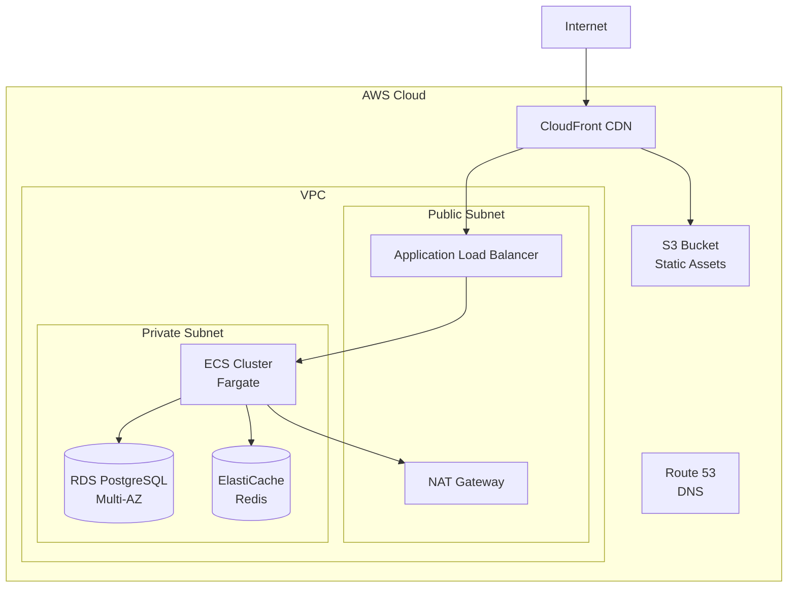
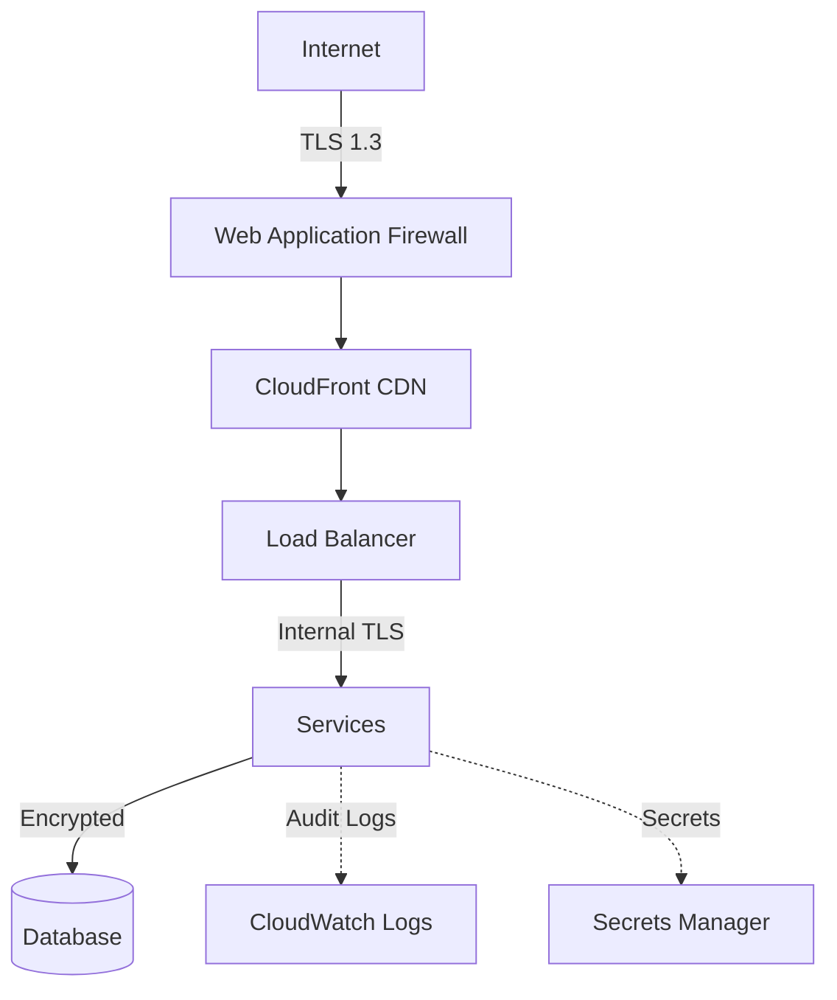

# System Architecture Document (SAD)

## [Project Name]

**Version:** 1.0.0  
**Date:** YYYY-MM-DD  
**Status:** Draft | In Review | Approved

**Prepared by:** [System Architect Name]  
**Reviewed by:** [Reviewer Name]  
**Approved by:** [Approver Name]

---

## Document Control

| Version | Date | Author | Changes |
|---------|------|--------|---------|
| 1.0.0 | YYYY-MM-DD | [Author] | Initial draft |

---

## Table of Contents

1. [Architecture Overview](#architecture-overview)
2. [Technology Stack](#technology-stack)
3. [System Context](#system-context)
4. [Container Architecture](#container-architecture)
5. [Component Design](#component-design)
6. [Data Architecture](#data-architecture)
7. [Integration Design](#integration-design)
8. [Infrastructure Design](#infrastructure-design)
9. [Security Architecture](#security-architecture)
10. [Architecture Decision Records](#architecture-decision-records)

---

## 1. Architecture Overview

### 1.1 Architecture Style

**Selected Pattern:** [Microservices | Monolithic | Event-Driven | Serverless | Hybrid]

**Rationale:** [Explain why this architecture pattern was chosen]

### 1.2 High-Level Architecture



### 1.3 Key Architecture Principles

1. **Scalability:** Horizontal scaling for all services
2. **Resilience:** Circuit breakers, retries, timeouts
3. **Security:** Defense in depth, least privilege
4. **Observability:** Comprehensive logging, metrics, tracing
5. **Maintainability:** Clear service boundaries, documentation

---

## 2. Technology Stack

### 2.1 Frontend

| Component | Technology | Version | Justification |
|-----------|-----------|---------|---------------|
| Web Framework | [React/Vue/Angular] | [X.X] | [Reason] |
| Mobile | [Flutter/React Native] | [X.X] | [Reason] |
| State Management | [Redux/MobX/Context] | [X.X] | [Reason] |
| UI Library | [Material-UI/Tailwind] | [X.X] | [Reason] |

### 2.2 Backend

| Component | Technology | Version | Justification |
|-----------|-----------|---------|---------------|
| Runtime | [Node.js/Python/Go] | [X.X] | [Reason] |
| Framework | [Express/FastAPI/Gin] | [X.X] | [Reason] |
| API Style | [REST/GraphQL/gRPC] | - | [Reason] |
| Authentication | [OAuth2/JWT] | - | [Reason] |

### 2.3 Data Storage

| Component | Technology | Version | Justification |
|-----------|-----------|---------|---------------|
| Primary Database | [PostgreSQL/MySQL] | [X.X] | [Reason] |
| Cache | [Redis/Memcached] | [X.X] | [Reason] |
| Message Queue | [Kafka/RabbitMQ] | [X.X] | [Reason] |
| Object Storage | [S3/GCS/Azure Blob] | - | [Reason] |

### 2.4 Infrastructure

| Component | Technology | Version | Justification |
|-----------|-----------|---------|---------------|
| Cloud Provider | [AWS/GCP/Azure] | - | [Reason] |
| Container Runtime | [Docker] | [X.X] | [Reason] |
| Orchestration | [Kubernetes/ECS] | [X.X] | [Reason] |
| CI/CD | [GitHub Actions/GitLab] | - | [Reason] |

---

## 3. System Context

### 3.1 System Context Diagram (C4 Level 1)



### 3.2 External Systems

| System | Purpose | Integration Type | SLA |
|--------|---------|------------------|-----|
| [System 1] | [Purpose] | [REST/GraphQL/Webhook] | [99.9%] |
| [System 2] | [Purpose] | [REST/GraphQL/Webhook] | [99.9%] |

---

## 4. Container Architecture

### 4.1 Container Diagram (C4 Level 2)



### 4.2 Container Responsibilities

**Web Application:**
- User interface for desktop browsers
- Client-side routing and state management
- Communicates with API Gateway via REST

**Mobile Application:**
- Native mobile experience (iOS/Android)
- Offline-first architecture
- Push notification handling

**API Gateway:**
- Request routing and load balancing
- Rate limiting and throttling
- Authentication and authorization
- Request/response transformation

**[Service Name] Service:**
- [Responsibility 1]
- [Responsibility 2]
- [Responsibility 3]

---

## 5. Component Design

### 5.1 [Service Name] Component Diagram (C4 Level 3)



### 5.2 Component Responsibilities

**API Controller:**
- Request validation
- Response formatting
- Error handling

**Business Logic:**
- Core business rules
- Transaction management
- Event publishing

**Data Access:**
- Database queries
- Caching logic
- Data mapping

### 5.3 Key Algorithms

**[Algorithm Name]:**
```
Input: [Description]
Output: [Description]

Steps:
1. [Step 1]
2. [Step 2]
3. [Step 3]

Complexity: O(n log n)
```

---

## 6. Data Architecture

### 6.1 Data Model (ERD)



### 6.2 Database Selection

**Primary Database:** PostgreSQL 15

**Rationale:**
- ACID transactions required for orders
- Complex queries with JOINs
- JSON support for flexible schemas
- Mature ecosystem and tooling

### 6.3 Data Partitioning Strategy

**Horizontal Sharding:**
- Shard key: `user_id`
- Sharding strategy: Consistent hashing
- Number of shards: 16 (initial), scale to 64

**Vertical Partitioning:**
- Hot data: SSD-backed storage
- Cold data: Archive storage (S3 + Glacier)

### 6.4 Caching Strategy

**Cache Layers:**

1. **CDN Cache:** Static assets (images, JS, CSS)
   - TTL: 1 year
   - Invalidation: Version-based URLs

2. **Application Cache (Redis):** API responses
   - TTL: 5 minutes (product catalog)
   - TTL: 1 hour (user profile)
   - Invalidation: Event-driven (on updates)

3. **Database Query Cache:** Frequently accessed queries
   - Automatic invalidation on writes

### 6.5 Backup & Recovery

**Backup Strategy:**
- Full backup: Daily at 2 AM UTC
- Incremental backup: Every 6 hours
- Retention: 30 days
- Cross-region replication: Enabled

**Recovery Procedures:**
- Point-in-time recovery (PITR): Last 7 days
- Disaster recovery testing: Monthly

---

## 7. Integration Design

### 7.1 API Design

**API Style:** RESTful

**Base URL:** `https://api.example.com/v1`

**Authentication:** Bearer token (JWT)

**Versioning Strategy:** URL versioning (`/v1`, `/v2`)

### 7.2 Key API Endpoints

| Method | Endpoint | Description | Rate Limit |
|--------|----------|-------------|------------|
| GET | `/users/{id}` | Get user profile | 100/min |
| POST | `/orders` | Create order | 10/min |
| GET | `/products` | List products | 1000/min |
| PUT | `/users/{id}` | Update user | 20/min |

### 7.3 Event-Driven Communication

**Event Bus:** Apache Kafka

**Event Schema:**
```json
{
  "event_id": "uuid",
  "event_type": "order.placed",
  "event_version": "1.0",
  "timestamp": "ISO-8601",
  "payload": {
    "order_id": "uuid",
    "user_id": "uuid",
    "total_amount": 150.00
  }
}
```

**Key Events:**
- `user.registered`
- `order.placed`
- `order.fulfilled`
- `payment.completed`

### 7.4 External API Integrations

**Payment Gateway (Stripe):**
- Integration type: REST API
- Authentication: API Key
- Webhook: Payment confirmation events

**Email Service (SendGrid):**
- Integration type: REST API
- Authentication: API Key
- Use cases: Transactional emails, notifications

---

## 8. Infrastructure Design

### 8.1 Cloud Architecture

**Cloud Provider:** AWS



### 8.2 Network Design

**VPC Configuration:**
- CIDR: `10.0.0.0/16`
- Availability Zones: 3
- Public Subnets: `10.0.1.0/24`, `10.0.2.0/24`, `10.0.3.0/24`
- Private Subnets: `10.0.11.0/24`, `10.0.12.0/24`, `10.0.13.0/24`

**Security Groups:**
- `web-sg`: Allow 80, 443 from Internet
- `app-sg`: Allow traffic from `web-sg` only
- `db-sg`: Allow 5432 from `app-sg` only

### 8.3 Auto-Scaling Configuration

**ECS Service Auto-Scaling:**
- Target CPU: 70%
- Target Memory: 80%
- Min instances: 3
- Max instances: 20
- Scale-out cooldown: 60 seconds
- Scale-in cooldown: 300 seconds

**Database Scaling:**
- Read replicas: 2 (can scale to 5)
- Connection pooling: PgBouncer (max 100 connections per instance)

### 8.4 Disaster Recovery

**Strategy:** Active-Passive Multi-Region

**Primary Region:** us-east-1  
**DR Region:** us-west-2

**Failover Triggers:**
- Primary region unavailable > 5 minutes
- RTO target: 4 hours
- RPO target: 1 hour

---

## 9. Security Architecture

### 9.1 Security Layers



### 9.2 Authentication & Authorization

**Authentication Flow:**
1. User submits credentials
2. API Gateway validates with Auth Service
3. Auth Service issues JWT (expires in 1 hour)
4. Refresh token valid for 30 days

**Authorization Model:** Role-Based Access Control (RBAC)

**Roles:**
- `admin`: Full access
- `user`: Standard user permissions
- `readonly`: Read-only access

### 9.3 Data Encryption

**Encryption at Rest:**
- Database: AES-256 (AWS RDS encryption)
- Object Storage: AES-256 (S3 default encryption)
- Backups: Encrypted with KMS

**Encryption in Transit:**
- External: TLS 1.3
- Internal: mTLS (service-to-service)

### 9.4 Security Monitoring

**Tools:**
- AWS GuardDuty: Threat detection
- AWS Security Hub: Security posture
- CloudTrail: API audit logs
- WAF: DDoS protection, rate limiting

---

## 10. Architecture Decision Records

### ADR-001: Microservices vs Monolithic

**Status:** Accepted  
**Date:** YYYY-MM-DD

**Context:**
We need to decide between microservices and monolithic architecture for our new platform.

**Decision:**
We will use microservices architecture.

**Rationale:**
- Independent deployment cycles needed
- Multiple teams working in parallel
- Different scaling requirements per service
- Technology diversity beneficial

**Consequences:**
- Increased operational complexity
- Need for service mesh (Istio)
- More sophisticated monitoring required

---

### ADR-002: [Decision Title]

**Status:** Proposed | Accepted | Deprecated | Superseded  
**Date:** YYYY-MM-DD

**Context:**
[Describe the forces at play, including technical, political, social, and project-related]

**Decision:**
[Describe the decision]

**Rationale:**
[Explain why this decision was made]

**Consequences:**
[Describe the resulting context after applying the decision]

---

**End of Document**
