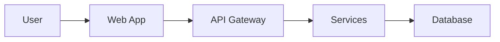

# System Requirements Document (SRD)

## [Project Name]

**Version:** 1.0.0  
**Date:** YYYY-MM-DD  
**Status:** Draft | In Review | Approved

**Prepared by:** [System Analyst Name]  
**Reviewed by:** [Reviewer Name]  
**Approved by:** [Approver Name]

---

## Document Control

| Version | Date | Author | Changes |
|---------|------|--------|---------|
| 1.0.0 | YYYY-MM-DD | [Author] | Initial draft |

---

## Table of Contents

1. [Executive Summary](#executive-summary)
2. [Functional Requirements](#functional-requirements)
3. [Non-Functional Requirements](#non-functional-requirements)
4. [Constraints](#constraints)
5. [User Stories](#user-stories)
6. [Use Cases](#use-cases)
7. [Assumptions](#assumptions)
8. [Risks](#risks)
9. [Glossary](#glossary)
10. [Appendix](#appendix)

---

## 1. Executive Summary

### 1.1 Business Objectives

[Describe the high-level business goals this system aims to achieve]

- Objective 1: [Description]
- Objective 2: [Description]
- Objective 3: [Description]

### 1.2 Success Criteria (KPIs)

| Metric | Target | Measurement |
|--------|--------|-------------|
| [Metric 1] | [Target value] | [How to measure] |
| [Metric 2] | [Target value] | [How to measure] |
| [Metric 3] | [Target value] | [How to measure] |

### 1.3 Project Scope

**In Scope:**
- [Feature/capability 1]
- [Feature/capability 2]
- [Feature/capability 3]

**Out of Scope:**
- [Excluded feature 1]
- [Excluded feature 2]
- [Excluded feature 3]

### 1.4 Budget & Timeline

**Budget:** $X,XXX,XXX  
**Timeline:** X months (Start: YYYY-MM-DD, End: YYYY-MM-DD)

**Milestones:**
- Month 1: [Milestone]
- Month 3: [Milestone]
- Month 6: [Milestone]

---

## 2. Functional Requirements

### FR-001: [Requirement Name]

**Description:** [Detailed description of the functional requirement]

**Priority:** Critical | High | Medium | Low

**Acceptance Criteria:**
- [ ] Criterion 1
- [ ] Criterion 2
- [ ] Criterion 3

**Dependencies:** [List any dependencies on other requirements or systems]

**Business Rules:**
- Rule 1: [Description]
- Rule 2: [Description]

---

### FR-002: [Requirement Name]

**Description:** [Detailed description]

**Priority:** Critical | High | Medium | Low

**Acceptance Criteria:**
- [ ] Criterion 1
- [ ] Criterion 2

**Dependencies:** None | [Dependencies]

---

[Repeat for each functional requirement...]

---

## 3. Non-Functional Requirements

### 3.1 Performance Requirements

| Metric | Requirement | Measurement Method |
|--------|-------------|---------------------|
| Response Time (P50) | < 100ms | Application metrics |
| Response Time (P95) | < 500ms | Application metrics |
| Response Time (P99) | < 1000ms | Application metrics |
| Throughput | 10,000 req/sec | Load testing |
| Concurrent Users | 100,000+ | Capacity testing |

### 3.2 Scalability Requirements

- System must scale horizontally to handle 10x traffic growth
- Database must support read replicas for read-heavy workloads
- Auto-scaling policies must trigger at 70% CPU/memory utilization
- Support for multi-region deployment

### 3.3 Availability & Reliability

**Target SLA:** 99.95% uptime (21.6 minutes downtime per month)

**Disaster Recovery:**
- **RPO (Recovery Point Objective):** < 1 hour
- **RTO (Recovery Time Objective):** < 4 hours

**Backup Strategy:**
- Daily automated backups
- 30-day retention period
- Cross-region backup replication

### 3.4 Security Requirements

**Authentication & Authorization:**
- Multi-factor authentication (MFA) for admin users
- OAuth 2.0 / OpenID Connect for user authentication
- Role-Based Access Control (RBAC)
- JWT token-based session management

**Data Protection:**
- Encryption at rest (AES-256)
- Encryption in transit (TLS 1.3)
- PII data masking in logs
- Regular security audits and penetration testing

**Compliance:**
- GDPR compliance for EU users
- SOC 2 Type II certification
- PCI DSS compliance (if handling payments)

### 3.5 Usability Requirements

- Mobile-responsive design (support iOS, Android, desktop)
- Accessibility: WCAG 2.1 Level AA compliance
- Support for multiple languages (i18n)
- Maximum 3 clicks to complete primary tasks

### 3.6 Maintainability Requirements

- Code coverage: minimum 80%
- Documentation for all APIs (OpenAPI 3.0)
- Automated deployment pipelines (CI/CD)
- Monitoring and alerting for all critical services

---

## 4. Constraints

### 4.1 Technical Constraints

- Must use [specific technology stack]
- Must integrate with existing [legacy system]
- API rate limits: [X requests per minute]
- Database transaction limits: [X per second]

### 4.2 Business Constraints

- Budget cap: $[amount]
- Go-live date: [YYYY-MM-DD] (non-negotiable)
- Must maintain backward compatibility with v1 API

### 4.3 Regulatory Constraints

- Must comply with [specific regulations]
- Data residency requirements: [specific countries]
- Audit trail retention: minimum [X years]

### 4.4 Resource Constraints

- Team size: [X developers, Y analysts]
- Third-party service costs: maximum $[amount]/month
- Infrastructure budget: $[amount]/month

---

## 5. User Stories

### US-001: [User Story Title]

**As a** [user role]  
**I want** [action/feature]  
**So that** [benefit/value]

**Priority:** Critical | High | Medium | Low

**Acceptance Criteria:**
- [ ] Given [precondition], when [action], then [expected result]
- [ ] Given [precondition], when [action], then [expected result]

**Story Points:** [X]

---

### US-002: [User Story Title]

**As a** [user role]  
**I want** [action/feature]  
**So that** [benefit/value]

**Priority:** Critical | High | Medium | Low

**Acceptance Criteria:**
- [ ] Given [precondition], when [action], then [expected result]

**Story Points:** [X]

---

[Repeat for each user story...]

---

## 6. Use Cases

### UC-001: [Use Case Name]

**Actor:** [Primary actor]

**Description:** [Brief description of the use case]

**Preconditions:**
- [Precondition 1]
- [Precondition 2]

**Main Flow:**
1. [Actor] [action]
2. System [response]
3. [Actor] [action]
4. System [response]

**Alternative Flows:**
- **2a.** If [condition], then [alternative action]
- **3a.** If [condition], then [alternative action]

**Exception Flows:**
- **E1.** If [error condition], system displays [error message]
- **E2.** If [error condition], system [recovery action]

**Postconditions:**
- [Expected state after use case completion]

---

### UC-002: [Use Case Name]

[Follow same structure as UC-001]

---

## 7. Assumptions

- Assumption 1: [Description and impact if incorrect]
- Assumption 2: [Description and impact if incorrect]
- Assumption 3: [Description and impact if incorrect]

---

## 8. Risks

| ID | Risk Description | Probability | Impact | Mitigation Strategy | Owner |
|----|------------------|-------------|--------|---------------------|-------|
| R-001 | [Risk description] | High/Med/Low | High/Med/Low | [Mitigation strategy] | [Name] |
| R-002 | [Risk description] | High/Med/Low | High/Med/Low | [Mitigation strategy] | [Name] |
| R-003 | [Risk description] | High/Med/Low | High/Med/Low | [Mitigation strategy] | [Name] |

---

## 9. Glossary

**[Term 1]:** Definition of term 1

**[Term 2]:** Definition of term 2

**[Term 3]:** Definition of term 3

---

## 10. Appendix

### A. Stakeholder List

| Name | Role | Responsibility | Contact |
|------|------|----------------|---------|
| [Name] | [Role] | [Responsibility] | [Email] |
| [Name] | [Role] | [Responsibility] | [Email] |

### B. References

- [Document 1] - Description and link
- [Document 2] - Description and link
- [Document 3] - Description and link

### C. Wireframes & Mockups

[Link to design files or embed images]

### D. Data Flow Diagrams

### E. Change Log

All document changes are tracked in the Document Control section at the beginning of this document.

---

**End of Document**
