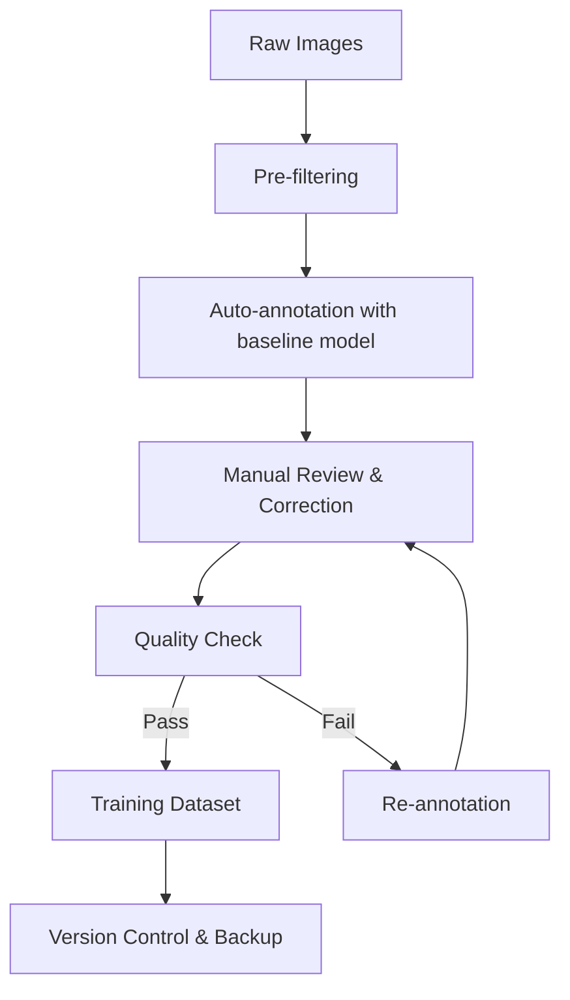

# AI in EMS (Electronic Manufacturing Services) - Computer Vision for PCB Inspection

## Overview: AI-Powered Quality Inspection Pipeline

Modern EMS operations require sub-millimeter precision inspection at high speed (1-2 seconds per board). Traditional rule-based AOI systems fail with complex boards, new component types, and varied lighting conditions. AI-powered computer vision enables:

- **Defect Detection:** 99.5%+ accuracy on 20+ defect types
- **Speed:** <1 second inference per PCB (real-time production)
- **Adaptability:** Fine-tune for new products in days vs months
- **Cost Reduction:** 70-90% fewer false positives vs traditional AOI
- **Scalability:** Single model handles multiple product families

**Business Impact:**
- Quality: Reduce escapes from 1000 PPM to <10 PPM
- Speed: 3-5x faster inspection vs human operators
- Cost: 50-70% reduction in manual inspection labor
- Yield: 2-5% improvement through early defect detection
- Traceability: 100% digital record with image evidence

---

## Part 1: PCB Defect Types & Inspection Requirements

### Common PCB Defects in SMT (Surface Mount Technology)

#### 1. Solder Joint Defects (Critical)
**Insufficient Solder:**
- Visual: Less than 50% pad coverage
- Impact: Weak electrical connection, intermittent failures
- Detection: Analyze solder fillet geometry, height profile

**Excess Solder:**
- Visual: Solder bridging between pads
- Impact: Short circuits, component damage
- Detection: Detect solder balls, bridging patterns

**Cold Solder Joint:**
- Visual: Dull, grainy appearance vs shiny smooth
- Impact: Poor electrical connection, long-term reliability issues
- Detection: Texture analysis, reflectivity patterns

**Solder Bridge:**
- Visual: Unintended solder connection between pins
- Impact: Short circuits, device malfunction
- Detection: Edge detection between adjacent pads

**Tombstoning (Manhattan Effect):**
- Visual: Component stands vertically on one pad
- Impact: Open circuit, component not functional
- Detection: Component orientation analysis, height profile

#### 2. Component Placement Defects
**Missing Component:**
- Visual: Empty pad/footprint
- Impact: Open circuit, non-functional feature
- Detection: Pad occupancy analysis

**Wrong Component (Incorrect Part):**
- Visual: Different package size, marking, color
- Impact: Wrong functionality, potential damage
- Detection: OCR on component markings, size verification

**Component Offset/Misalignment:**
- Visual: Shifted from pad center (X/Y offset)
- Impact: Potential solder joint issues
- Detection: Centroid detection, pad-to-component distance

**Component Rotation (Wrong Orientation):**
- Visual: 90°/180° rotated vs correct orientation
- Impact: Polarity issues, non-functional
- Detection: Pin-1 marker detection, fiducial alignment

**Component Tilt/Coplanarity:**
- Visual: Component not flat on PCB
- Impact: Poor solder joint, mechanical stress
- Detection: 3D profile analysis, shadow detection

#### 3. Polarity & Marking Defects
**Reverse Polarity:**
- Visual: Polarity marker (cathode band) wrong direction
- Impact: Component damage, circuit failure
- Detection: OCR on markings, cathode band detection

**Missing/Damaged Marking:**
- Visual: Component ID, polarity marks illegible
- Impact: Traceability issues, assembly errors
- Detection: OCR confidence scores

#### 4. Contamination & Physical Damage
**Flux Residue:**
- Visual: Residue on pads/components
- Impact: Corrosion, electrical leakage
- Detection: Texture analysis, color deviation

**Solder Balls/Splatter:**
- Visual: Small solder spheres on board
- Impact: Potential short circuits
- Detection: Blob detection, size filtering

**Scratches/Damage:**
- Visual: PCB substrate damage, lifted traces
- Impact: Opens, shorts, reliability issues
- Detection: Edge detection, surface irregularities

**Foreign Material:**
- Visual: Dust, debris, label fragments
- Impact: Short circuits, cosmetic issues
- Detection: Object detection, anomaly detection

#### 5. PCB Substrate Issues
**Lifted Pad:**
- Visual: Pad detached from substrate
- Impact: Open circuit, assembly issues
- Detection: Height profile, pad edge analysis

**Wrong PCB Version:**
- Visual: Different revision, layout
- Impact: Incorrect assembly, rework required
- Detection: Fiducial pattern matching, barcode verification

---

## Part 2: Data Collection & Labeling Pipeline

### Phase 1: Data Collection Strategy

#### Camera Setup Requirements
```
Hardware Specifications:
- Resolution: 5MP+ (2448x2048 minimum)
- Sensor: Sony IMX264 or equivalent CMOS
- Lens: 8-16mm focal length, C-mount
- Lighting: 4-zone LED ring light (white, 6500K)
- Frame Rate: 30 FPS minimum
- Interface: GigE Vision or USB3 Vision

Lighting Considerations:
- Ring light: Reduces shadows, uniform illumination
- Coaxial light: Highlights reflective surfaces (solder)
- Dark field: Emphasizes edges, scratches
- Structured light: 3D height profiling

Positioning:
- Top-down: 90° perpendicular to PCB
- Angled (optional): 30-45° for height info
- Field of View: 50x50mm to 100x100mm per image
- Working Distance: 200-400mm
```

#### Image Collection Guidelines
```python
# Collection Parameters
total_boards_needed = 1000  # Minimum dataset size
defects_per_type = {
    'insufficient_solder': 200,
    'excess_solder': 150,
    'solder_bridge': 100,
    'missing_component': 150,
    'wrong_component': 80,
    'component_offset': 200,
    'tombstone': 50,
    'reverse_polarity': 100,
    'scratches': 80,
    'solder_balls': 120
}

# Diversity Requirements
products = ['Product_A', 'Product_B', 'Product_C']  # Multiple product families
lighting_conditions = ['standard', 'bright', 'dim']
camera_angles = ['0_deg', '5_deg_tilt']

# Capture Strategy
images_per_board = 20  # Multiple regions per board
good_to_defect_ratio = 0.7  # 70% good, 30% defects
```

#### Data Organization Structure
```
dataset/
├── raw_images/
│   ├── ProductA/
│   │   ├── 2024-01-15/
│   │   │   ├── board_001_region_01.jpg
│   │   │   ├── board_001_region_02.jpg
│   │   │   └── metadata.json
│   │   └── 2024-01-16/
│   └── ProductB/
├── labeled_data/
│   ├── ProductA/
│   │   ├── images/
│   │   ├── labels/  # YOLO format txt files
│   │   └── classes.txt
│   └── ProductB/
└── metadata/
    ├── defect_taxonomy.yaml
    ├── camera_calibration.json
    └── collection_log.csv
```

### Phase 2: Labeling Workflow

#### Tool Selection

**CVAT (Computer Vision Annotation Tool) - Recommended for EMS**
```yaml
Pros:
  - Web-based, multi-user collaboration
  - Supports bounding box, polygon, segmentation
  - Video annotation (inspection recordings)
  - Auto-annotation with existing models
  - Quality review workflows
  - Export formats: YOLO, COCO, Pascal VOC

Setup:
  - Docker deployment (self-hosted)
  - Integrates with AWS S3, Azure Blob
  - LDAP authentication for team access
  - Pre-annotation with YOLOv8 to reduce manual work

Cost: Free (open source)
Learning Curve: Medium
Team Scalability: Excellent (20+ annotators)
```

**Roboflow (Cloud-based) - Fast Iteration**
```yaml
Pros:
  - Managed platform, no infrastructure
  - Built-in augmentation & preprocessing
  - Auto-labeling with foundation models
  - Version control for datasets
  - One-click export to training formats

Cons:
  - Cost scales with images (paid tiers)
  - Data stored on external cloud

Best For: Small teams (1-5 people), rapid prototyping
Cost: $0-$500/month depending on images
```

**LabelImg (Desktop) - Simple & Fast**
```yaml
Pros:
  - Lightweight desktop app
  - Offline labeling
  - Direct YOLO format export
  - Keyboard shortcuts for speed

Cons:
  - Single-user only
  - No collaboration features
  - Manual quality control

Best For: Individual annotators, proof-of-concept
Cost: Free
```

#### Labeling Standards & Guidelines

**1. Class Definition (Defect Taxonomy)**
```yaml
# classes.txt
0: insufficient_solder
1: excess_solder
2: solder_bridge
3: missing_component
4: wrong_component
5: component_offset
6: component_rotation
7: tombstone
8: reverse_polarity
9: scratches
10: solder_balls
11: flux_residue
12: lifted_pad

# Hierarchical Structure (Advanced)
solder_defects:
  - insufficient_solder
  - excess_solder
  - solder_bridge
  - cold_joint

component_defects:
  - missing
  - wrong_part
  - offset
  - rotation
  - tombstone

polarity_defects:
  - reverse_polarity
  - missing_marking
```

**2. Bounding Box Guidelines**
```
Tight Boxing:
- Box tightly around defect region
- Include minimal background
- For component defects: box the entire component + pads

Multi-Defect Handling:
- If component has 2+ defects: create 2+ boxes
- Example: Component offset + reverse polarity = 2 boxes

Edge Cases:
- Partially visible defects: box visible portion
- Occluded defects: skip if <30% visible
- Ambiguous defects: flag for expert review
```

**3. Annotation Quality Metrics**
```python
# Track annotator performance
quality_metrics = {
    'inter_annotator_agreement': 0.95,  # Target: >95%
    'annotation_speed': 150,  # Images per hour
    'review_pass_rate': 0.90,  # Target: >90%
    'edge_case_handling': 'documented'
}

# Quality Control Process
1. Dual annotation: 10% of images annotated by 2 people
2. Expert review: 5% random sampling by senior engineer
3. Disagreement resolution: Weekly review meetings
```

#### Labeling Workflow (Production-Scale)



**Step-by-Step Process:**

1. **Pre-filtering (Automated)**
```python
# Remove blurry, overexposed, or corrupt images
def pre_filter_images(image_dir):
    for img_path in image_dir:
        img = cv2.imread(img_path)
        
        # Blur detection (Laplacian variance)
        blur_score = cv2.Laplacian(img, cv2.CV_64F).var()
        if blur_score < 100:  # Threshold
            move_to_rejected(img_path)
        
        # Exposure check
        mean_intensity = img.mean()
        if mean_intensity < 30 or mean_intensity > 225:
            move_to_rejected(img_path)
```

2. **Auto-annotation (Semi-automated)**
```python
from ultralytics import YOLO

# Use existing model to pre-label
baseline_model = YOLO('yolov8n.pt')  # Or pretrained PCB model

def auto_annotate(image_dir):
    for img_path in image_dir:
        results = baseline_model.predict(img_path, conf=0.5)
        
        # Export to YOLO format
        save_yolo_labels(results, img_path.replace('.jpg', '.txt'))
        
# Human annotators only correct/add missing labels
# Saves 60-80% labeling time
```

3. **Manual Review (Human-in-Loop)**
```
Annotator Workflow:
1. Open pre-labeled image in CVAT
2. Verify existing boxes (correct class, tight boxing)
3. Add missing defects
4. Delete false positives
5. Mark ambiguous cases for expert review
6. Save and move to next image

Speed Target: 100-150 images/hour per person
```

4. **Quality Control (Expert Review)**
```python
# Random sampling for QC
import random

def quality_control_sampling(labeled_dataset, sample_rate=0.05):
    total_images = len(labeled_dataset)
    sample_size = int(total_images * sample_rate)
    
    sampled_images = random.sample(labeled_dataset, sample_size)
    
    # Expert reviews for:
    # - Annotation accuracy
    # - Consistency across annotators
    # - Edge case handling
    
    return sampled_images
```

#### Team Structure for Large-Scale Labeling

```
PCB Inspection Labeling Team (for 50K images):

1. Annotation Team Lead (1 person)
   - Define labeling standards
   - Resolve annotation disputes
   - Track quality metrics

2. Senior Annotators (2-3 people)
   - Domain experts (electronics background)
   - Handle edge cases
   - Quality review
   - Training new annotators

3. Junior Annotators (5-10 people)
   - High-volume labeling
   - Follow standard guidelines
   - Flag ambiguous cases

4. Quality Assurance (1-2 people)
   - Random sampling review
   - Inter-annotator agreement checks
   - Data versioning

Timeline: 50K images @ 100 images/hour/person = 500 hours
With 10 annotators = 50 hours (2 weeks full-time)
```

---

## Part 3: Model Training Pipeline

### Architecture Selection

#### YOLOv8 (Recommended for Real-Time AOI)

**Why YOLOv8 for PCB Inspection:**
```
Strengths:
✅ Real-time inference: 50-100 FPS on GPU, 10-20 FPS on CPU
✅ High accuracy: mAP@0.5 of 90-95% achievable
✅ Small model variants: YOLOv8n runs on edge devices
✅ Easy fine-tuning: Pretrained on COCO, transfer learning
✅ Export flexibility: ONNX, TensorRT, CoreML

Alternatives Considered:
- Faster R-CNN: Higher accuracy but 10x slower (not real-time)
- EfficientDet: Good balance, but harder to deploy on edge
- Custom CNN: Requires extensive data, longer development
```

**Model Variants:**
```python
# Choose based on hardware constraints
models = {
    'yolov8n': {  # Nano - Edge devices
        'params': '3.2M',
        'size': '6MB',
        'speed_gpu': '80 FPS',
        'speed_cpu': '15 FPS',
        'mAP': '37.3%',
        'use_case': 'Low-cost AOI machines, embedded systems'
    },
    'yolov8s': {  # Small - Production default
        'params': '11.2M',
        'size': '22MB',
        'speed_gpu': '60 FPS',
        'speed_cpu': '8 FPS',
        'mAP': '44.9%',
        'use_case': 'Standard AOI machines with basic GPU'
    },
    'yolov8m': {  # Medium - High accuracy
        'params': '25.9M',
        'size': '52MB',
        'speed_gpu': '40 FPS',
        'speed_cpu': '4 FPS',
        'mAP': '50.2%',
        'use_case': 'Offline inspection, complex boards'
    },
    'yolov8l': {  # Large - Research
        'params': '43.7M',
        'size': '87MB',
        'speed_gpu': '30 FPS',
        'speed_cpu': '2 FPS',
        'mAP': '52.9%',
        'use_case': 'Initial development, benchmark'
    }
}

# Recommendation: Start with YOLOv8s, optimize to YOLOv8n for deployment
```

### Training Infrastructure

#### Hardware Requirements
```
Training Workstation:
├── GPU: NVIDIA RTX 4090 (24GB VRAM) or A100
├── CPU: AMD Ryzen 9 / Intel i9 (16+ cores)
├── RAM: 64GB+ DDR5
├── Storage: 2TB NVMe SSD
└── OS: Ubuntu 22.04 LTS

Cloud Alternative (AWS):
├── Instance: p3.2xlarge (1x V100 16GB)
├── Storage: S3 bucket for dataset
├── Cost: ~$3/hour (spot instance)
└── Total Training Cost: $50-150 per model

Edge Inference Hardware (Production AOI):
├── Option 1: NVIDIA Jetson Orin Nano (8GB) - $499
├── Option 2: Intel NUC with Intel Arc GPU - $600
├── Option 3: Raspberry Pi 5 + Coral TPU - $150
└── Option 4: Industrial PC with GTX 1650 - $800
```

#### Training Environment Setup
```bash
# Install dependencies
pip install ultralytics torch torchvision opencv-python albumentations

# Verify GPU
python -c "import torch; print(torch.cuda.is_available())"
# Should output: True

# Download pretrained weights
wget https://github.com/ultralytics/assets/releases/download/v0.0.0/yolov8s.pt
```

### Dataset Preparation

#### YOLO Format Structure
```
pcb_defect_dataset/
├── data.yaml
├── train/
│   ├── images/
│   │   ├── board001_001.jpg
│   │   ├── board001_002.jpg
│   │   └── ...
│   └── labels/
│       ├── board001_001.txt
│       ├── board001_002.txt
│       └── ...
├── val/
│   ├── images/
│   └── labels/
└── test/
    ├── images/
    └── labels/
```

**data.yaml Configuration:**
```yaml
# Dataset paths
path: /data/pcb_defect_dataset
train: train/images
val: val/images
test: test/images

# Class definitions
names:
  0: insufficient_solder
  1: excess_solder
  2: solder_bridge
  3: missing_component
  4: wrong_component
  5: component_offset
  6: component_rotation
  7: tombstone
  8: reverse_polarity
  9: scratches
  10: solder_balls

# Class counts (for reference)
nc: 11  # Number of classes

# Dataset statistics
total_images: 10000
train_images: 7000  # 70%
val_images: 2000    # 20%
test_images: 1000   # 10%
```

**Label Format (YOLO txt):**
```
# Each line: class_id center_x center_y width height (normalized 0-1)
0 0.516 0.323 0.086 0.124  # insufficient_solder at center
2 0.789 0.456 0.045 0.067  # solder_bridge
5 0.234 0.678 0.112 0.134  # component_offset
```

#### Data Augmentation Strategy
```python
# Training augmentation configuration
augmentation_config = {
    # Geometric
    'rotate': 15,  # ±15 degrees rotation
    'scale': 0.2,  # ±20% scale variation
    'translate': 0.1,  # ±10% translation
    'shear': 5,  # ±5 degrees shear
    'flipud': 0.5,  # 50% vertical flip
    'fliplr': 0.5,  # 50% horizontal flip
    
    # Photometric
    'hsv_h': 0.015,  # Hue variation
    'hsv_s': 0.7,  # Saturation variation
    'hsv_v': 0.4,  # Value/brightness variation
    'brightness': 0.2,  # ±20% brightness
    'contrast': 0.2,  # ±20% contrast
    
    # Noise & Blur
    'blur': 0.01,  # Gaussian blur
    'noise': 0.02,  # Gaussian noise
    
    # Mosaic & Mixup (advanced)
    'mosaic': 1.0,  # 100% use mosaic augmentation
    'copy_paste': 0.1,  # 10% copy-paste augmentation
}

# Why these augmentations:
# - Rotation: PCBs can be rotated in fixture
# - Scale: Camera distance variations
# - Lighting (HSV): Different lighting conditions on production floor
# - Blur: Camera focus variations
# - Mosaic: Trains model on multi-region images
```

### Training Configuration

#### Hyperparameters for PCB Defect Detection
```python
from ultralytics import YOLO

# Load pretrained model
model = YOLO('yolov8s.pt')

# Training hyperparameters
training_config = {
    'data': 'data.yaml',
    'epochs': 200,  # Start with 200, monitor validation
    'batch': 32,  # Adjust based on GPU memory (16GB: 32, 24GB: 64)
    'imgsz': 640,  # Input image size (640x640)
    'optimizer': 'AdamW',  # AdamW better than SGD for small datasets
    'lr0': 0.001,  # Initial learning rate
    'lrf': 0.01,  # Final learning rate (lr0 * lrf)
    'momentum': 0.937,
    'weight_decay': 0.0005,
    'warmup_epochs': 5,  # Warmup for 5 epochs
    'cos_lr': True,  # Cosine learning rate scheduler
    
    # Data augmentation (inline)
    'hsv_h': 0.015,
    'hsv_s': 0.7,
    'hsv_v': 0.4,
    'degrees': 15.0,
    'translate': 0.1,
    'scale': 0.2,
    'shear': 5.0,
    'flipud': 0.5,
    'fliplr': 0.5,
    'mosaic': 1.0,
    
    # Loss weights
    'box': 7.5,  # Box loss weight
    'cls': 0.5,  # Classification loss weight
    'dfl': 1.5,  # Distribution focal loss weight
    
    # Validation & Checkpoints
    'val': True,  # Validate every epoch
    'save': True,  # Save checkpoints
    'save_period': 10,  # Save every 10 epochs
    'patience': 50,  # Early stopping patience
    
    # Hardware
    'device': 0,  # GPU device ID (0 for first GPU)
    'workers': 8,  # Data loading workers
    'project': 'pcb_defect_detection',
    'name': 'yolov8s_v1',
    'exist_ok': True,
    
    # Advanced
    'pretrained': True,  # Use COCO pretrained weights
    'resume': False,  # Resume from last checkpoint
    'amp': True,  # Automatic Mixed Precision (faster training)
}

# Start training
results = model.train(**training_config)
```

#### Training Script (Production-Ready)
```python
#!/usr/bin/env python3
"""
PCB Defect Detection Training Script
Usage: python train_pcb_model.py --config config.yaml
"""

import torch
from ultralytics import YOLO
import yaml
import logging
from pathlib import Path
import argparse

# Setup logging
logging.basicConfig(
    level=logging.INFO,
    format='%(asctime)s - %(levelname)s - %(message)s',
    handlers=[
        logging.FileHandler('training.log'),
        logging.StreamHandler()
    ]
)
logger = logging.getLogger(__name__)

def train_model(config_path='config.yaml'):
    """Train YOLOv8 model for PCB defect detection."""
    
    # Load configuration
    with open(config_path, 'r') as f:
        config = yaml.safe_load(f)
    
    logger.info(f"Starting training with config: {config_path}")
    logger.info(f"GPU Available: {torch.cuda.is_available()}")
    logger.info(f"GPU Device: {torch.cuda.get_device_name(0) if torch.cuda.is_available() else 'None'}")
    
    # Initialize model
    model_size = config.get('model_size', 'yolov8s')
    model = YOLO(f'{model_size}.pt')
    
    # Train
    try:
        results = model.train(
            data=config['data'],
            epochs=config.get('epochs', 200),
            batch=config.get('batch', 32),
            imgsz=config.get('imgsz', 640),
            device=config.get('device', 0),
            workers=config.get('workers', 8),
            project=config.get('project', 'runs/detect'),
            name=config.get('name', 'pcb_defect'),
            exist_ok=True,
            patience=config.get('patience', 50),
            save=True,
            save_period=10,
            cache=True,  # Cache images for faster training
            amp=True,  # Mixed precision
        )
        
        logger.info("Training completed successfully!")
        logger.info(f"Best model saved at: {results.save_dir}/weights/best.pt")
        
        # Validation metrics
        metrics = model.val()
        logger.info(f"Validation mAP@0.5: {metrics.box.map50:.4f}")
        logger.info(f"Validation mAP@0.5:0.95: {metrics.box.map:.4f}")
        
        return results
        
    except Exception as e:
        logger.error(f"Training failed: {str(e)}")
        raise

if __name__ == '__main__':
    parser = argparse.ArgumentParser()
    parser.add_argument('--config', type=str, default='config.yaml')
    args = parser.parse_args()
    
    train_model(args.config)
```

### Monitoring Training Progress

#### Key Metrics to Track
```python
# Metrics logged during training
metrics_to_monitor = {
    # Loss metrics (lower is better)
    'train/box_loss': 'Bounding box regression loss',
    'train/cls_loss': 'Classification loss',
    'train/dfl_loss': 'Distribution focal loss',
    
    # Validation metrics (higher is better)
    'metrics/precision': 'Precision (TP / (TP + FP))',
    'metrics/recall': 'Recall (TP / (TP + FN))',
    'metrics/mAP50': 'Mean Average Precision @ IoU=0.5',
    'metrics/mAP50-95': 'Mean Average Precision @ IoU=0.5:0.95',
    
    # Per-class metrics
    'metrics/precision(class_0)': 'Insufficient solder precision',
    'metrics/recall(class_2)': 'Solder bridge recall',
    # ... for each defect class
}

# Good training indicators:
# 1. Losses decrease steadily
# 2. Validation mAP increases
# 3. No overfitting (train loss << val loss)
# 4. Per-class metrics balanced (no single class dominating)
```

#### Using TensorBoard
```bash
# During training, logs are saved to runs/detect/train/
tensorboard --logdir runs/detect/train/ --port 6006

# Open browser: http://localhost:6006
# Monitor:
# - Loss curves
# - Precision/Recall curves
# - mAP progression
# - Learning rate schedule
# - Sample predictions
```

#### Early Stopping & Checkpoints
```python
# Model checkpoints saved automatically
checkpoints = {
    'best.pt': 'Best validation mAP model',
    'last.pt': 'Last epoch model (resume training)',
}

# Early stopping triggers when:
# - Validation mAP doesn't improve for 'patience' epochs
# - Default patience: 50 epochs
# - Adjust based on dataset size:
#   - Small dataset (<5K images): patience=30
#   - Large dataset (>20K images): patience=100
```

### Model Optimization for Edge Deployment

#### Quantization (INT8)
```python
from ultralytics import YOLO

# Load trained model
model = YOLO('runs/detect/train/weights/best.pt')

# Export to TensorRT INT8 (quantized)
model.export(
    format='engine',  # TensorRT
    imgsz=640,
    half=False,  # Use INT8 instead of FP16
    int8=True,  # Enable INT8 quantization
    data='data.yaml',  # Calibration data
    workspace=4,  # Max workspace size (GB)
)

# Speed improvement: 2-4x faster inference
# Accuracy drop: <1% mAP typically
```

#### Pruning (Model Compression)
```python
# Prune less important filters/channels
# Reduces model size by 30-50% with minimal accuracy loss

from ultralytics.utils.torch_utils import model_info

# Analyze model before pruning
model_info(model, imgsz=640)
# Output: 11.2M parameters, 28.6 GFLOPs

# Apply pruning (requires custom implementation)
# After pruning: 5.8M parameters, 15.2 GFLOPs
# Accuracy drop: ~1-2% mAP
```

---

## Part 4: Model Validation & Testing

### Validation Metrics

#### Confusion Matrix Analysis
```python
from ultralytics import YOLO

model = YOLO('best.pt')
results = model.val(data='data.yaml', split='test')

# Analyze confusion matrix
# Rows: True labels
# Columns: Predicted labels
# Diagonal: Correct predictions

# Common issues in PCB inspection:
# 1. 'insufficient_solder' confused with 'excess_solder'
#    -> Improve labeling consistency, add more samples
# 
# 2. 'component_offset' missed (false negatives)
#    -> Lower confidence threshold, add augmentation
#
# 3. Background classified as defects (false positives)
#    -> Add negative samples, adjust classification threshold
```

#### Per-Class Performance
```python
# Critical defects (must detect):
critical_defects = ['solder_bridge', 'missing_component', 'reverse_polarity']
required_recall = 0.99  # 99% recall minimum

# Cosmetic defects (can tolerate misses):
cosmetic_defects = ['scratches', 'flux_residue']
required_recall = 0.85  # 85% recall acceptable

# Check per-class recall
for class_name, recall in class_metrics.items():
    if class_name in critical_defects and recall < required_recall:
        logger.warning(f"{class_name} recall {recall:.2f} below threshold!")
```

### Production Validation (Real AOI Machine)

#### Test Procedure
```
1. Collect 1000 boards from production line
   - 700 known-good boards (golden samples)
   - 300 boards with intentional defects (seeded defects)

2. Run through AI model
   - Record predictions: class, confidence, bounding box
   - Log inference time per board
   
3. Manual verification (ground truth)
   - Inspect all AI detections manually
   - Record: True Positive, False Positive, False Negative
   
4. Calculate production metrics:
   - Defect Capture Rate (DCR): TP / (TP + FN)
   - False Call Rate (FCR): FP / Total Inspections
   - First Pass Yield (FPY): Boards passed without rework
   
5. Compare vs legacy AOI:
   - DCR: AI should be 10-20% higher
   - FCR: AI should be 50-70% lower
   - Speed: AI should be 2-3x faster
```

#### Acceptance Criteria (Industry Standards)
```
Production Acceptance Metrics:

Defect Capture Rate (DCR):
- Critical defects: >99.5% (solder bridges, shorts)
- Major defects: >98% (component placement errors)
- Minor defects: >95% (cosmetic issues)

False Call Rate (FCR):
- Target: <5% of total inspections
- Acceptable: <10%
- Unacceptable: >15% (too many false alarms)

Inspection Speed:
- Target: <2 seconds per board
- Acceptable: <3 seconds per board

Repeatability:
- Same board, 10 runs: >99% consistent results
```

---

## Part 5: Deployment to AOI Machines

### Edge Deployment Architecture

```
AOI Machine Architecture:

┌─────────────────────────────────────────┐
│        Camera System (Top-down)         │
│  - 5MP Industrial Camera                │
│  - LED Ring Light Controller            │
│  - Motorized Focus                      │
└────────────────┬────────────────────────┘
                 │ GigE Vision / USB3
                 ▼
┌─────────────────────────────────────────┐
│      Edge AI Computer (Local)           │
│  - NVIDIA Jetson Orin Nano (8GB)        │
│  - TensorRT Optimized Model             │
│  - Image Preprocessing                  │
│  - Real-time Inference (<50ms)          │
└────────────────┬────────────────────────┘
                 │ MQTT / REST API
                 ▼
┌─────────────────────────────────────────┐
│       MES Integration Layer             │
│  - Production tracking                  │
│  - Defect statistics                    │
│  - Traceability database                │
│  - Alert system (SMS/Email)             │
└─────────────────────────────────────────┘
```

### Software Stack

#### Inference Engine Setup
```python
# inference_server.py
from ultralytics import YOLO
import cv2
import numpy as np
from flask import Flask, request, jsonify
import time

app = Flask(__name__)

# Load optimized model
MODEL_PATH = '/opt/models/pcb_defect.engine'  # TensorRT
model = YOLO(MODEL_PATH)

# Warm-up inference
dummy_img = np.zeros((640, 640, 3), dtype=np.uint8)
model(dummy_img)  # First inference is slow, warm up GPU

@app.route('/inspect', methods=['POST'])
def inspect_pcb():
    """
    API endpoint for PCB inspection
    
    Request:
        - image: Base64 encoded JPEG
        - board_id: Unique board identifier
        - confidence_threshold: Detection threshold (default: 0.6)
    
    Response:
        - defects: List of detected defects
        - inference_time: Time taken (ms)
        - board_id: Input board ID
    """
    try:
        # Parse request
        data = request.json
        img_base64 = data['image']
        board_id = data.get('board_id', 'unknown')
        conf_threshold = data.get('confidence', 0.6)
        
        # Decode image
        img_data = base64.b64decode(img_base64)
        nparr = np.frombuffer(img_data, np.uint8)
        img = cv2.imdecode(nparr, cv2.IMREAD_COLOR)
        
        # Run inference
        start_time = time.time()
        results = model(img, conf=conf_threshold, verbose=False)[0]
        inference_time = (time.time() - start_time) * 1000  # ms
        
        # Parse results
        defects = []
        for box in results.boxes:
            defect = {
                'class': model.names[int(box.cls)],
                'confidence': float(box.conf),
                'bbox': box.xyxy[0].tolist(),  # [x1, y1, x2, y2]
            }
            defects.append(defect)
        
        # Response
        response = {
            'board_id': board_id,
            'defects': defects,
            'defect_count': len(defects),
            'inference_time_ms': round(inference_time, 2),
            'pass': len(defects) == 0,
        }
        
        return jsonify(response), 200
        
    except Exception as e:
        return jsonify({'error': str(e)}), 500

if __name__ == '__main__':
    app.run(host='0.0.0.0', port=5000)
```

#### Camera Integration (GenICam/GigE Vision)
```python
# camera_driver.py
from harvesters.core import Harvester
import numpy as np

class AOICamera:
    def __init__(self, gentl_path='/opt/mvIMPACT/lib/x86_64/mvGenTLProducer.cti'):
        self.h = Harvester()
        self.h.add_file(gentl_path)
        self.h.update()
        
        # Connect to first available camera
        self.ia = self.h.create_image_acquirer(0)
        self.ia.start_acquisition()
    
    def capture_image(self):
        """Capture single frame from camera."""
        with self.ia.fetch_buffer() as buffer:
            # Get image data
            component = buffer.payload.components[0]
            img = component.data.reshape(
                component.height,
                component.width,
                -1 if component.num_components_per_pixel > 1 else 1
            )
            
            # Convert to RGB if needed
            if img.shape[2] == 1:  # Grayscale
                img = cv2.cvtColor(img, cv2.COLOR_GRAY2RGB)
            
            return img.copy()
    
    def set_exposure(self, exposure_us):
        """Set camera exposure time (microseconds)."""
        self.ia.remote_device.node_map.ExposureTime.value = exposure_us
    
    def set_gain(self, gain_db):
        """Set camera gain (dB)."""
        self.ia.remote_device.node_map.Gain.value = gain_db
    
    def close(self):
        """Release camera resources."""
        self.ia.stop_acquisition()
        self.ia.destroy()
        self.h.reset()
```

#### Production Workflow
```python
# main_inspection_loop.py
import time
import logging
from camera_driver import AOICamera
from inference_server import run_inference
from database import save_inspection_result

logger = logging.getLogger(__name__)

def main_inspection_loop():
    """
    Main production inspection loop
    Runs continuously on AOI machine
    """
    camera = AOICamera()
    
    logger.info("AOI System Ready")
    
    while True:
        try:
            # Wait for board present signal (GPIO or PLC)
            if not board_present():
                time.sleep(0.1)
                continue
            
            # Get board ID from barcode scanner
            board_id = read_barcode()
            logger.info(f"Inspecting board: {board_id}")
            
            # Capture image
            img = camera.capture_image()
            
            # Run inference
            start_time = time.time()
            results = run_inference(img, board_id)
            inference_time = time.time() - start_time
            
            # Decision logic
            if results['pass']:
                logger.info(f"Board {board_id} PASS")
                signal_pass()  # Green light, conveyor continue
            else:
                logger.warning(f"Board {board_id} FAIL - {len(results['defects'])} defects")
                signal_fail()  # Red light, divert to rework station
                
                # Save defect image
                save_defect_image(img, board_id, results['defects'])
            
            # Log to database
            save_inspection_result(board_id, results, inference_time)
            
            # Performance monitoring
            if inference_time > 2.0:  # >2 seconds is too slow
                logger.warning(f"Slow inference: {inference_time:.2f}s")
            
        except Exception as e:
            logger.error(f"Inspection error: {str(e)}")
            signal_error()  # Yellow light, stop line
            time.sleep(1)

if __name__ == '__main__':
    main_inspection_loop()
```

### MES (Manufacturing Execution System) Integration

#### Data Flow to MES
```python
# mes_integration.py
import requests
import json
from datetime import datetime

class MESIntegration:
    def __init__(self, mes_api_url, api_key):
        self.api_url = mes_api_url
        self.headers = {
            'Authorization': f'Bearer {api_key}',
            'Content-Type': 'application/json'
        }
    
    def report_inspection(self, board_id, results):
        """Send inspection results to MES."""
        
        payload = {
            'board_id': board_id,
            'timestamp': datetime.utcnow().isoformat(),
            'station_id': 'AOI_01',
            'pass': results['pass'],
            'defects': results['defects'],
            'inference_time_ms': results['inference_time_ms'],
        }
        
        response = requests.post(
            f'{self.api_url}/inspections',
            headers=self.headers,
            json=payload,
            timeout=5
        )
        
        if response.status_code != 200:
            raise Exception(f"MES API error: {response.text}")
        
        return response.json()
    
    def get_board_info(self, board_id):
        """Retrieve board information from MES."""
        response = requests.get(
            f'{self.api_url}/boards/{board_id}',
            headers=self.headers,
            timeout=5
        )
        
        return response.json()
```

#### Dashboard Integration (Real-time Monitoring)
```python
# dashboard_api.py
from flask import Flask, jsonify
from database import get_statistics

app = Flask(__name__)

@app.route('/api/stats/realtime')
def realtime_stats():
    """Real-time production statistics."""
    stats = {
        'boards_inspected_today': get_boards_count_today(),
        'defects_detected_today': get_defects_count_today(),
        'current_fpy': calculate_first_pass_yield(),  # %
        'top_defects': get_top_defects(limit=5),
        'avg_inference_time_ms': get_avg_inference_time(),
    }
    return jsonify(stats)

@app.route('/api/stats/defect_trends')
def defect_trends():
    """Defect trends over time."""
    trends = get_defect_trends(days=30)
    return jsonify(trends)
```

---

## Part 6: Model Maintenance & Continuous Improvement

### Model Drift Detection

```python
# monitor_model_drift.py
import numpy as np
from scipy.stats import ks_2samp

def detect_distribution_drift(baseline_scores, current_scores, threshold=0.05):
    """
    Detect if prediction confidence distribution has shifted.
    Uses Kolmogorov-Smirnov test.
    """
    statistic, p_value = ks_2samp(baseline_scores, current_scores)
    
    if p_value < threshold:
        return True, f"Drift detected (p={p_value:.4f})"
    return False, "No significant drift"

# Run weekly
baseline_confidences = load_baseline_data()  # First month of production
current_confidences = get_last_week_confidences()

drift, message = detect_distribution_drift(baseline_confidences, current_confidences)
if drift:
    alert_ml_team(message)
```

### Retraining Pipeline

```
Retraining Triggers:
1. Monthly scheduled retraining (preventive)
2. Defect capture rate drops >5% (reactive)
3. False call rate increases >10% (reactive)
4. New product launch (proactive)
5. 10K+ new labeled images collected (data-driven)

Retraining Process:
1. Collect production images (past month)
2. Sample 1000 images for manual labeling
3. Merge with existing training set
4. Retrain model (incremental learning)
5. Validate on holdout test set
6. A/B test in production (1 AOI machine)
7. If metrics improve >2%, deploy to all machines
```

---

## Part 7: Key Success Metrics

### Technical Metrics
```
Model Performance:
- mAP@0.5: >90% (overall)
- Per-class recall: >95% (critical defects)
- Inference time: <50ms (real-time)
- Model size: <50MB (edge deployment)

Production Metrics:
- Defect Capture Rate: >99% (vs 85-90% traditional AOI)
- False Call Rate: <5% (vs 15-20% traditional AOI)
- Inspection speed: <2 seconds per board
- First Pass Yield: +3-5% improvement
```

### Business Impact
```
Cost Savings:
- Labor reduction: 5 operators → 1 (80% savings)
- Rework cost reduction: 50-70%
- Warranty claims reduction: 40-60%

Quality Improvements:
- Customer returns: -30-50%
- Production yield: +3-5%
- Inspection consistency: 99% vs 70% (human)

Time to Market:
- New product ramp: 2 weeks vs 3 months (traditional AOI programming)
```

---

**Philosophy:** AI in EMS is not just about replacing human inspectors—it's about creating a closed-loop quality system that learns, adapts, and improves continuously. The goal: zero defects escaping to customers while maximizing production throughput.
